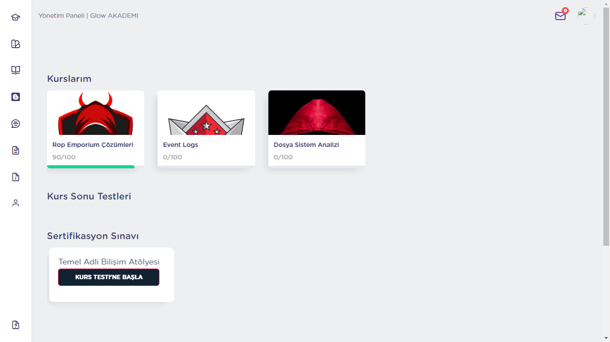

# GlowLMS
Turkish/English Complete Learning Management System Based on Laravel 9
## Features
- HLS playlist for lessons (Convert to transport stream with electron-mp4-viewer repo)
- Checkout/Cart
- Certificate Exam
- Canvas certificate/Certificate validation
- Courses subscription with time period (e.g 2 months subscription)
- Bundles
- Admin and student dashboard
- Chat
- Profile
## Structure
- Laravel 9
- Mysql
- Docker
### This project was based on Laravel 7 and I'm updating it nowadays.Many packages were abandoned and banned,so it can be tough for me to make things right.Anyway source code will be here after code refactoring and update.

## Screenshots

##

##

##

##

##

